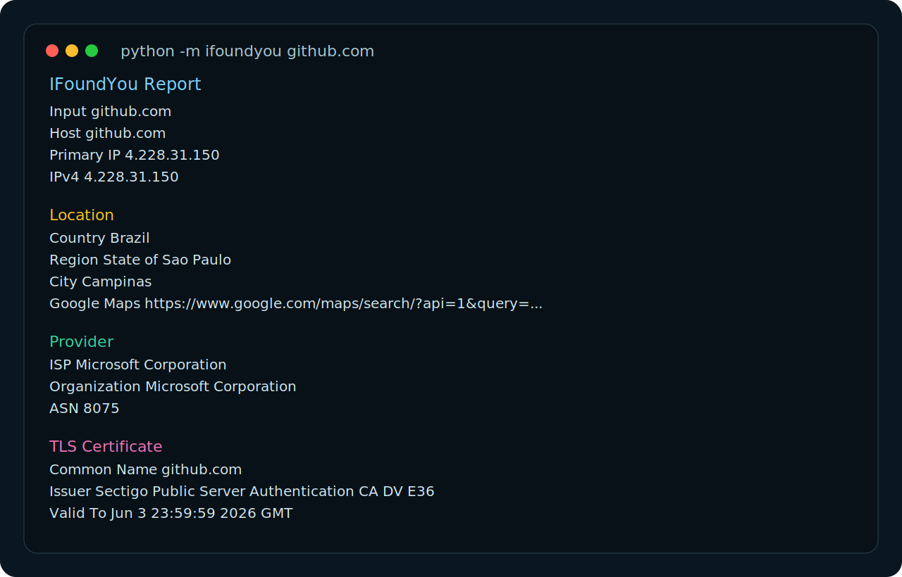

# IFoundYou

`IFoundYou` is a practical host-inspection CLI for Windows and Linux. Give it an IP, domain, or full URL and it turns that target into a readable report with DNS resolution, geolocation context, provider data, TLS certificate details, map links, JSON output, and Markdown exports.

It started as a tiny bash geolocation script. This new version keeps the original spirit, but upgrades it into a real tool that people can use for support work, homelabs, blue-team triage, bug reports, web diagnostics, and quick network sanity checks.



## Why this is useful

- Inspect domains, raw IPs, and URLs with one command.
- Run the same workflow on Windows PowerShell and Linux shells.
- Resolve DNS locally before geolocation, which makes domain lookups more reliable.
- Pull provider and ASN context fast when you need to understand who is behind an endpoint.
- Summarize TLS certificate identity and validity for HTTPS targets.
- Export reports as JSON for automation or Markdown for incident notes and tickets.
- Check your own public IP with `--self`.

## Quick start

### Windows

```powershell
git clone https://github.com/sularhen/IFoundYou.git
cd IFoundYou
python -m pip install -e .
ifoundyou github.com
```

You can also use the included PowerShell wrapper:

```powershell
.\whereareyou.ps1 github.com
```

### Linux

```bash
git clone https://github.com/sularhen/IFoundYou.git
cd IFoundYou
python3 -m pip install -e .
ifoundyou github.com
```

Or keep the original feel with the legacy wrapper:

```bash
chmod +x whereareyou.sh
./whereareyou.sh github.com
```

## Example commands

```bash
ifoundyou github.com
ifoundyou https://openai.com --json
ifoundyou --self
ifoundyou --batch targets.txt --save reports/team-scan.md
ifoundyou 8.8.8.8 --save reports/dns.json
```

## Example output

```text
IFoundYou Report
========================================================
Input            github.com
Host             github.com
Primary IP       4.228.31.150
IPv4             4.228.31.150

Location
--------------------------------------------------------
Country          Brazil
Region           State of Sao Paulo
City             Campinas

Provider
--------------------------------------------------------
ISP              Microsoft Corporation
Organization     Microsoft Corporation
ASN              8075

TLS Certificate
--------------------------------------------------------
Common Name      github.com
Issuer           Sectigo Public Server Authentication CA DV E36
```

## Command reference

```text
usage: ifoundyou [-h] [--self] [--batch BATCH] [--json] [--save SAVE]
                 [--timeout TIMEOUT] [--no-ssl]
                 [target]
```

- `target`: IP, domain, or URL.
- `--self`: inspect your current public IP.
- `--batch`: load targets from a text file, one per line.
- `--json`: print structured JSON.
- `--save`: export to `.json` or `.md`.
- `--timeout`: override the network timeout.
- `--no-ssl`: skip certificate checks.

## How it works

1. The target is normalized from an IP, domain, or URL.
2. DNS is resolved locally using the Python standard library.
3. A public geolocation API is queried for the resolved IP.
4. TLS metadata is collected directly from the remote server when applicable.
5. Everything is merged into one human-readable or machine-readable report.

## Project structure

```text
.
|-- assets/
|   |-- banner.svg
|   `-- demo-report.svg
|-- src/ifoundyou/
|   |-- cli.py
|   |-- core.py
|   `-- formatters.py
|-- tests/
|   `-- test_core.py
|-- whereareyou.ps1
`-- whereareyou.sh
```

## Privacy note

`IFoundYou` performs local DNS and TLS inspection on your machine, and uses public web services for public IP detection and geolocation enrichment. That means the inspected IP may be sent to those external services during lookup. For local-only scenarios, disable the tool or adapt the providers for your own environment.

## Development

```bash
python -m unittest discover -s tests -v
```

## License

MIT
